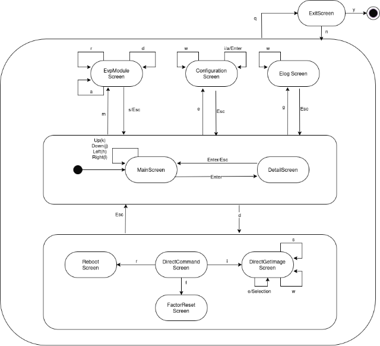

# Device Monitor

`device-monitor` is a TUI tool designed to manage and observe AITRIOS devices
through MQTT communication for debugging purposes. It provides a user-friendly
interface for interacting with devices, logging events, and visualizing device
data in real-time. 


## Key Features:
- **MQTT Communication**: Connect to an MQTT broker to send and receive messages from IoT devices.
- **Terminal UI**: A responsive and interactive terminal-based user interface for monitoring and managing devices.
- **AITRIOS DTDL v2 Support**: Implements the AITRIOS Device Twin Definition Language (DTDl) v2 for device management.
- **EVP v2 Protocol Support**: Supports the EVP v2 protocol and the _Device Control Service_ interface to `SystemApp`.
- **Logging**: Configurable logging with support for different verbosity levels.
- **Customizable**: Easily configurable MQTT broker address and logging options via command-line arguments.
- **Error Handling**: Robust error handling using `error_stack` for detailed error reporting.

## How to build
[Install rust on your system](https://www.rust-lang.org/tools/install) and then run the following command to build the tool:

```bash
cargo build --release
```

## Supposed Usage
This tool is intended to be used in a development environment as follows:

- An AITRIOS device to be monitored is connected to a local network.
  - Only 1 device can be monitored.
  - The device is configured to work in Non-TLS mode and be able to connect to a
    MQTT broker located in the local network.
- Following software modules running on a host pc or device which is connected
  to the same local network as the AITRIOS device:
  - A MQTT broker (e.g., Mosquitto) is running to facilitate communication
    between the AITRIOS device.
  - A Azurite local Azure Storage emulator used for test storage.
  - Device Monitor tool (this tool).

### Install MQTT Broker
You can install `mosquitto` as the MQTT broker as follows:

```bash
sudo apt install mosquitto
```

Configure the `mosquitto` to accept connections from the local network by
creating a `/etc/mosquitto/conf.d/local_network.conf` file with the following
content:

```
listener 1883 0.0.0.0
allow_anonymous true
```

### Install Azurite
You can install  and start `Azurite` as the Azure Storage emulator as follows:

```bash
docker run -p 10000:10000 \
           -p 10001:10001 \
           -p 10002:10002 \
           mcr.microsoft.com/azure-storage/azurite
```

### Device Monitor Command parameters

The synopsis of the command is as follows:

```
Usage: device-monitor [OPTIONS]

Options:
  -b, --broker <BROKER>            MQTT broker address [default: localhost:1883]
  -a, --azurite-url <AZURITE_URL>  Azurite url [default: https://127.0.1:10000]
  -l, --log <LOG>                  Log file
  -v, --verbose...                 Verbose
  -h, --help                       Print help
  -V, --version                    Print version
```

#### Example Usage:
```bash
# Basic usage
$ device-monitor \
       --broker 192.168.28.3:1883 \
       --azurite-url https://192.168.28.4:10000 \
       --log device-monitor.log --verbose

# Maximum verbosity (trace level)
$ device-monitor \
       -b 192.168.28.3:1883 \
       -a https://192.168.28.4:10000 \
       -l device-monitor.log \
       -vv
```

**Note**
* Suppose MQTT broker is running on the device with IP address of
`192.168.28.3` and Azurite is running on the device with IP address of `192.168.28.4`  
* The port number of Azurite should follow the exported port number of the
  Azurite container.

### Screen Transition

Following is the screen transition of the tool with the key-press:



* MainScreen: Main screen.
  * Up/k:       Move focus up.
  * Down/j:     Move focus down.
  * Enter:      Open the focus area in detail screen.
  * d:          Move to direct command screen.
  * m:          Move to EVP module screen.
  * e:          Move to configuration screen of focused area.
  * q:          Move to exit screen.
* DetailScreen: Detail screen of the focused area.
  * d:          Move to direct command screen.
  * m:          Move to EVP module screen.
  * e:          Move to configuration screen of focused area.
  * Esc/Enter:  Move back to previous screen.
  * q:          Move to exit screen.
* DirectCommandScreen: Direct command screen.
  * r:          Move to reboot screen.
  * i:          Move DirectGetImage screen.
  * f:          Move FactoryReset screen.
  * Esc:        Move back to previous screen.
  * q:          Move to exit screen.
* DirectGetImageScreen: Direct get image screen.
  * e:          Edit parameters.
  * w:          Show DirectGetImage command request.
  * s:          Send DirectGetImage command.
  * Esc:        Move back to previous screen.
  * q:          Move to exit screen.
* RebootScreen: Reboot screen.
  * w:          Show Reboot command request.
  * s:          Send Reboot command.
  * Esc:        Move back to previous screen.
  * q:          Move to exit screen.
* FactoryResetScreen: Factory reset screen.
  * w:          Show FactoryReset command request.
  * s:          Send FactoryReset command.
  * Esc:        Move back to previous screen.
  * q:          Move to exit screen.
* EVPModuleScreen: EVP module operating screen.
  * a:          Add a new module.
  * r:          Remove the selected module.
  * d:          Deploy the selected module.
  * Esc:        Move back to previous screen.
  * q:          Move to exit screen.
* ConfigurationScreen: Configuration screen of the focused area.
  * i/a/Enter:  Edit the configuration item.
  * w:          Show the configuration item request.
  * s:          Send the configuration item request.
* ELOG: Elog screen.
  * w:          Save the ELOG to a file.
  * Esc:        Move back to previous screen.
  * q:          Move to exit screen.
* ExitScreen: Exit screen.
  * y:          Exit the tool.
  * n:          Move back to previous screen.
