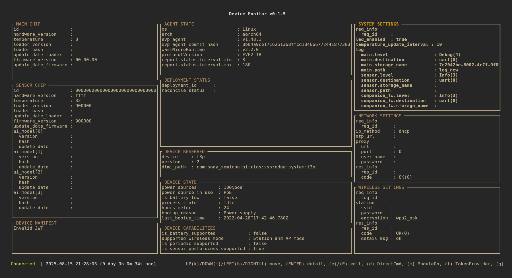
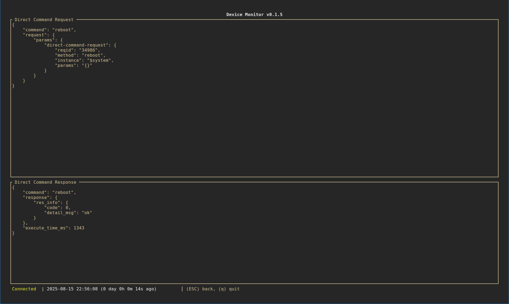
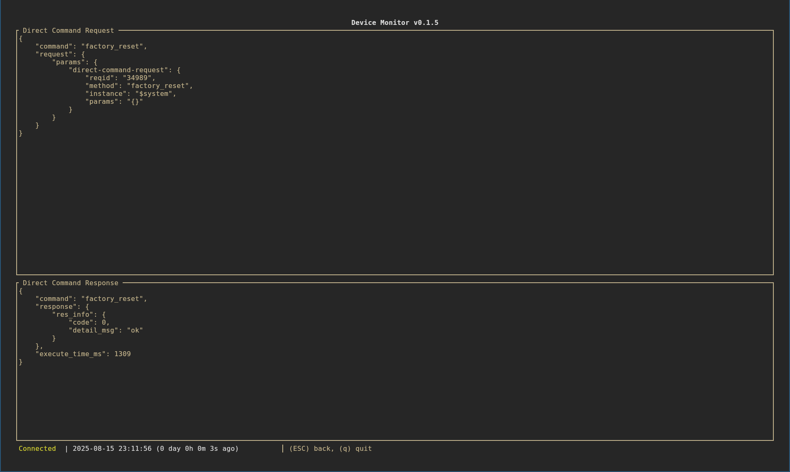
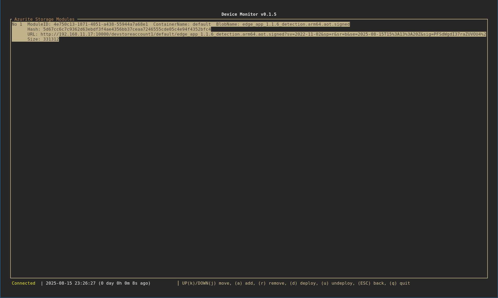

# Device Monitor

## Table of Contents
- [Introduction](#introduction)
- [Key Features](#key-features)
- [Installation](#installation)
  - [Prerequisites](#prerequisites)
  - [System Setup](#system-setup)
- [Command Parameters](#command-parameters)
  - [Synopsis](#synopsis)
  - [Options](#options)
  - [Verbosity Levels](#verbosity-levels)
  - [Example Usage](#example-usage)
- [User Interface (UI)](#user-interface-ui)
  - [UI Overview](#ui-overview)
  - [Main Screen](#main-screen)
  - [Direct Command Screen](#direct-command-screen)
  - [Azurite Storage Modules Screen](#azurite-storage-modules-screen)

## Introduction

Device Monitor is a Terminal User Interface (TUI) tool designed to manage and observe AITRIOS devices through MQTT communication for debugging purposes. It provides a user-friendly interface for interacting with devices, logging events, and visualizing device data in real-time.

## Key Features
- **MQTT Communication**: Connect to an MQTT broker to send and receive messages from IoT devices
- **Terminal UI**: A responsive and interactive terminal-based user interface for monitoring and managing devices
- **AITRIOS DTDL v2 Support**: Implements the AITRIOS Device Twin Definition Language (DTDL) v2 for device management
- **EVP v2 Protocol Support**: Supports the EVP v2 protocol and the Device Control Service interface to SystemApp
- **Logging**: Configurable logging with support for different verbosity levels
- **Error Handling**: Robust error handling with detailed error reporting

## Installation

### Prerequisites

Before using Device Monitor, you need to set up the following components:

#### 1. Install Rust
[Install Rust on your system](https://www.rust-lang.org/tools/install) to build the tool.

#### 2. Build Device Monitor
```bash
cargo build --release
```

#### 3. Install MQTT Broker
Install `mosquitto` as the MQTT broker:
```bash
sudo apt install mosquitto
```

Configure mosquitto to accept connections from the local network by creating a `/etc/mosquitto/conf.d/local_network.conf` file with the following content:
```
listener 1883 0.0.0.0
allow_anonymous true
```

#### 4. Install Azurite
Install and start `Azurite` as the Azure Storage emulator:
```bash
docker run -p 10000:10000 \
           -p 10001:10001 \
           -p 10002:10002 \
           mcr.microsoft.com/azure-storage/azurite
```

### System Setup
This tool is intended to be used in a development environment with:
- An AITRIOS device connected to a local network (only 1 device can be monitored)
- The device configured to work in Non-TLS mode and able to connect to a MQTT broker in the local network
- A MQTT broker (e.g., Mosquitto) running on the host PC or device
- Azurite local Azure Storage emulator for test storage
- Device Monitor tool

## Command Parameters

### Synopsis
```
Usage: device-monitor [OPTIONS]
```

### Options
- `-b, --broker <BROKER>` - MQTT broker address (default: localhost:1883)
- `-a, --azurite-url <AZURITE_URL>` - Azurite URL (default: https://127.0.0.1:10000)
- `-l, --log <LOG>` - Log file path
- `-v, --verbose` - Verbose logging (can be used multiple times for increased verbosity)
- `-h, --help` - Print help information
- `-V, --version` - Print version information

### Verbosity Levels
- No `-v`: INFO level logging
- `-v`: DEBUG level logging
- `-vv`: TRACE level logging (maximum verbosity)

### Example Usage

#### Basic Usage
```bash
device-monitor \
    --broker 192.168.28.3:1883 \
    --azurite-url https://192.168.28.4:10000 \
    --log device-monitor.log --verbose
```

#### Maximum Verbosity
```bash
device-monitor \
    -b 192.168.28.3:1883 \
    -a https://192.168.28.4:10000 \
    -l device-monitor.log \
    -vv
```

**Note**: In these examples, the MQTT broker is running on IP address `192.168.28.3` and Azurite is running on IP address `192.168.28.4`. The port number for Azurite should match the exported port number of the Azurite container.

## User Interface (UI)

### UI Overview

Device Monitor provides a comprehensive terminal-based interface with multiple screens for different functionalities:

- **Main Screen**: Dashboard showing device information with focus areas 
- **Direct Command Screen**: Execute direct commands on the device
- **Azurite Blob Screen**: Modules and OTA files stored in the Azurite blob storage, which can be deployed to the device
- **Token Provider Screens**: Manage authentication tokens and view blob storage
- **Event Log Screen**: View and save device event logs
- **Edge App Screen**: Manage edge applications
- **OTA Screens**: Firmware update management and configuration
- **Exit Screen**: Confirmation dialog for exiting the application

### Main Screen

When you start the application, you will see the Main Screen displaying device information.



The main screen has multiple sections. You can use the following keys to move focus around each section of the main screen:

- **Up/k**: Move focus up
- **Down/j**: Move focus down

You can also use the following keys to display the focused area in full screen:

- **Enter**: Open the focused area in detail screen


The details of each section are described below:

#### Device Information Sections
Device information such as ID, hardware version, temperature, and corresponding software information.

  * Main chip information
  * Companion/Sensor chip information
  * Device manifest

The information in this section is read-only. You cannot configure the values directly.

#### EVP Runtime Information Section

The EVP runtime module is used to provide device-to-cloud communication and EdgeApp WASM AoT deployment. In this section, the following information is displayed:

* OS of the edge device
* Architecture of the edge device
* EVP runtime version information
* EVP protocol version
* Report interval settings, which define how EVP runtime reports device state to the cloud.

The report interval settings can be configured by pressing the **e** key.

#### EdgeApp Deployment Status Section

The deployment status of EdgeApp modules. This section is read-only. If no EdgeApp modules are deployed, no information is displayed.
  

#### Device Reserved Information Section

Information related to the AITRIOS device-to-cloud communication protocol. The information in this section is read-only.

#### Device State Information Section

The following edge device state information is displayed:

* Power source-related information
* Battery information
* Boot-up related time information

The information in this section is read-only.

#### Device Capability Information

Edge device capability-related information. The information in this section is read-only.

#### System Settings Section

The following system settings are displayed:

* LED enable setting
* Temperature reporting interval setting
* Log-related settings for each module
  * Log level
  * Log output destination (console or cloud)
  * Cloud destination-related settings

The settings in this section can be configured by pressing the **e** key.

#### Network Settings Section

The following network settings-related information is displayed:

* Static/Dynamic IP address setting
* Static IP address-related settings
  * IP address
  * Subnet mask
  * Gateway
  * DNS
* Proxy settings

The settings in this section can be configured by pressing the **e** key.

#### Wireless Settings Section

The following wireless settings-related information is displayed:

* SSID
* Password
* Encryption type

The settings in this section can be configured by pressing the **e** key.

#### Connection Status

This is part of the footer information area. The connection state of the edge device is displayed:

* Connection status (connected or disconnected)
* Last connection time (the latest time when a message was received from the edge device)


#### Key Navigation and Information

Hints about keys the user can use to navigate the main screen are displayed. Error or information messages are also displayed.


### Direct Command Screen

When pressing **d** from the main screen, the screen will switch to the Direct Command screen.


In this screen, you can execute `Reboot`, `DirectGetImage`, and `FactoryReset` direct commands.

#### Reboot Direct Command

You can press the **r** key to reboot the device.



The response of the command is displayed on the screen.

#### DirectGetImage Screen Navigation

You can press the **i** key to switch to the `DirectGetImage` command screen.


In this screen, you can set the AI Model ID (`network_id`) for `DirectGetImage` by pressing the **i** or **a** key to enter edit mode. After editing the value, you can press the **Enter** or **Esc** key to save the value.

When you set the AI Model ID, you can press the **s** key to send the direct command to the device.


If the direct command is executed successfully, the response will be displayed in the `Direct Command Response` section. The captured image is encoded in base64 and stored in the `image` entry. You can press the **w** key to save the image to a JPEG file.

#### FactoryReset Direct Command

You can press the **f** key to execute `FactoryReset` on the device.



### Azurite Storage Modules Screen

When pressing **e** from the main screen, the screen will switch to the Azurite Storage Modules screen.



In this screen, all EdgeApp modules and OTA files that can be deployed to the edge device are displayed.

You can use **Up/k** and **Down/j** keys to move focus around the list. You can press the **d** key to deploy the focused module to the device as an EdgeApp module.

You can press the **a** key to specify a local module file and upload it to Azurite storage. Alternatively, you can press the **r** key to remove the module from Azurite storage.
