# Device Monitor User Interface (UI)

## Table of Contents
- [User Interface (UI)](#user-interface-ui)
  - [UI Overview](#ui-overview)
  - [Main Screen](#main-screen)
  - [Direct Command Screen](#direct-command-screen)
  - [Azurite Storage Modules Screen](#azurite-storage-modules-screen)
  - [Token Provider Screens](#token-provider-screens)
  - [Event Log Screen](#event-log-screen)
  - [AI Model Deploy Screen](#ai-model-deploy-screen)
  - [OTA Screen](#ota-screen)
  - [Exit Screen](#exit-screen)

## UI Overview

Device Monitor provides a comprehensive terminal-based interface with multiple screens for different functionalities:

- **Main Screen**: Dashboard showing device information with focus areas
- **Direct Command Screen**: Execute direct commands on the device
- **Azurite Blob Screen**: Modules and OTA files stored in Azurite blob storage that can be deployed to the device
- **Token Provider Screens**: Manage authentication tokens and view blob storage
- **Event Log Screen**: View and save device event logs
- **AI Model Deploy Screen**: Deploy AI models to the device
- **OTA Screens**: Firmware update management and configuration
- **Exit Screen**: Confirmation dialog for exiting the application

## Main Screen

When you start the application, you will see the Main Screen displaying device information.

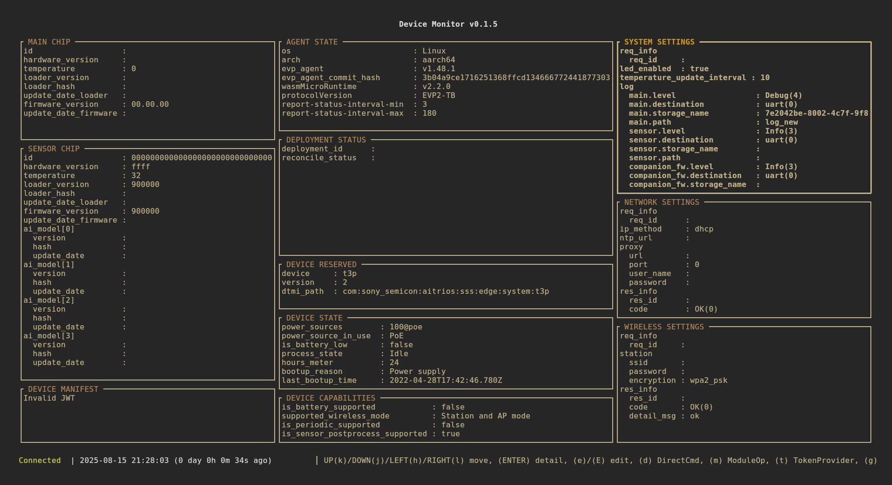

The main screen has multiple sections. You can use the following keys to move focus around each section of the main screen:

- **Up/k**: Move focus up
- **Down/j**: Move focus down

You can also use the following keys to display the focused area in full screen:

- **Enter**: Open the focused area in detail screen

The details of each section are described below:

### Device Information Sections
Device information such as ID, hardware version, temperature, and corresponding software information.

  * Main chip information
  * Companion/Sensor chip information
  * Device manifest

The information in this section is read-only. You cannot configure these values directly.

### EVP Runtime Information Section

The EVP runtime module is used to provide device-to-cloud communication and EdgeApp WASM AoT deployment. In this section, the following information is displayed:

* OS of the edge device
* Architecture of the edge device
* EVP runtime version information
* EVP protocol version
* Report interval settings, which define how the EVP runtime reports device state to the cloud

The report interval settings can be configured by pressing the **e** key.

### EdgeApp Deployment Status Section

The deployment status of EdgeApp modules. This section is read-only. If no EdgeApp modules are deployed, no information is displayed.

### Device Reserved Information Section

Information related to the AITRIOS device-to-cloud communication protocol. The information in this section is read-only.

### Device State Information Section

The following edge device state information is displayed:

* Power source-related information
* Battery information
* Boot-up time information

The information in this section is read-only.

### Device Capability Information

Edge device capability information. The information in this section is read-only.

### System Settings Section

The following system settings are displayed:

* LED enable setting
* Temperature reporting interval setting
* Log-related settings for each module
  * Log level
  * Log output destination (console or cloud)
  * Cloud destination-related settings

The settings in this section can be configured by pressing the **e** key.

### Network Settings Section

The following network settings information is displayed:

* Static/Dynamic IP address settings
* Static IP address settings
  * IP address
  * Subnet mask
  * Gateway
  * DNS
* Proxy settings

The settings in this section can be configured by pressing the **e** key.

### Wireless Settings Section

The following wireless settings information is displayed:

* SSID
* Password
* Encryption type

The settings in this section can be configured by pressing the **e** key.

### Connection Status

This is part of the footer information area. The connection state of the edge device is displayed:

* Connection status (connected or disconnected)
* Last connection time (the most recent time when a message was received from the edge device)

### Key Navigation and Information

Hints about keys you can use to navigate the main screen are displayed. Error or information messages are also displayed.

## Direct Command Screen

When you press **d** from the main screen, the screen will switch to the Direct Command screen.

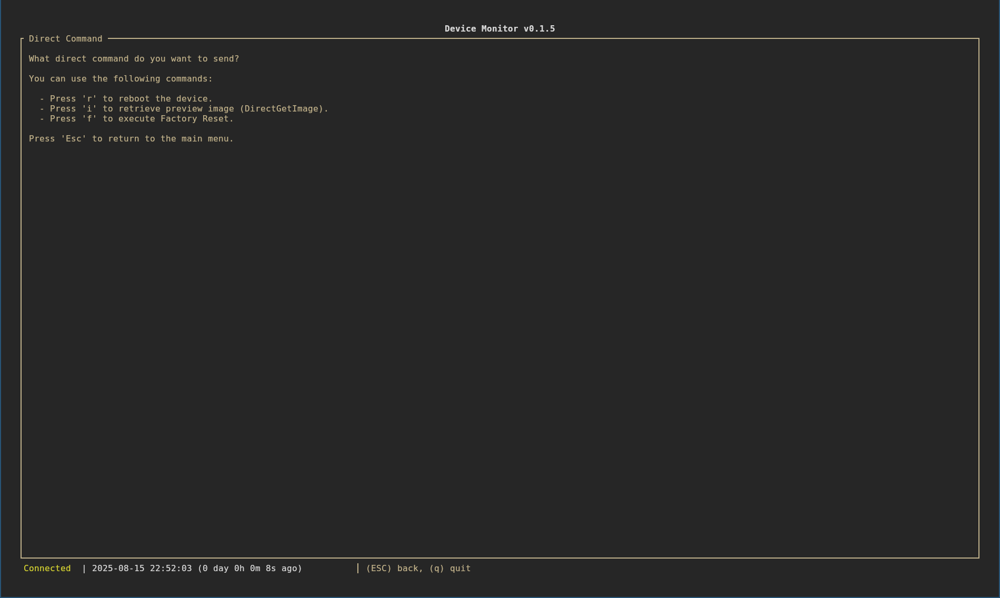

In this screen, you can execute `Reboot`, `DirectGetImage`, and `FactoryReset` direct commands.

### Reboot Direct Command

You can press the **r** key to reboot the device.

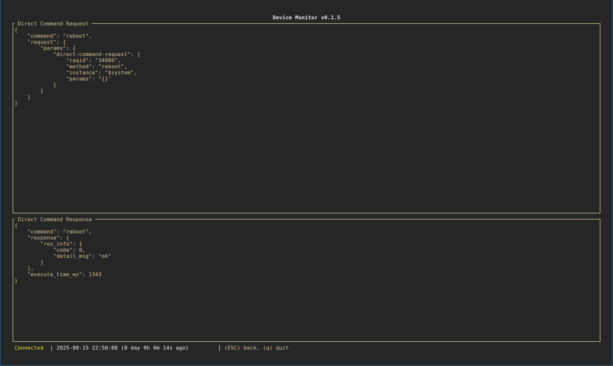

The command response is displayed on the screen.

### DirectGetImage Screen Navigation

You can press the **i** key to switch to the `DirectGetImage` command screen.

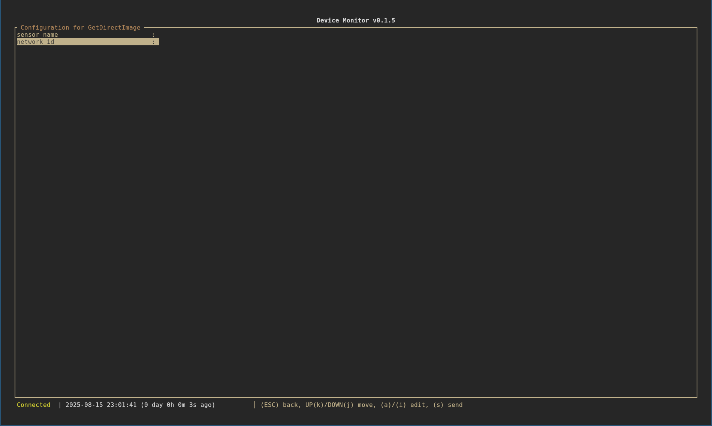

In this screen, you can set the AI Model ID (`network_id`) for `DirectGetImage` by pressing the **i** or **a** key to enter edit mode. After editing the value, you can press the **Enter** or **Esc** key to save the changes.

When you set the AI Model ID, you can press the **s** key to send the direct command to the device.

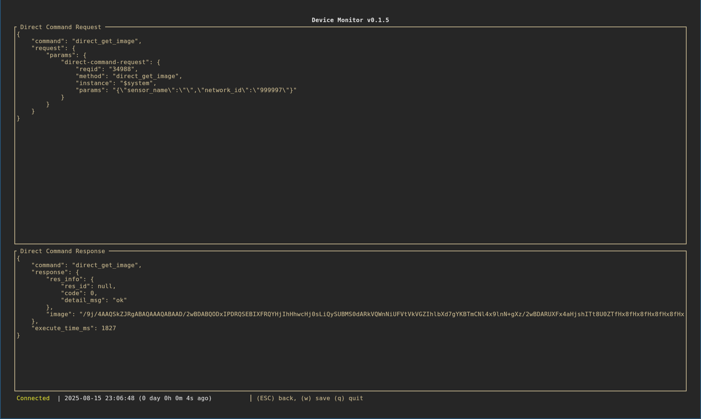

If the direct command is executed successfully, the response will be displayed in the `Direct Command Response` section. The captured image is encoded in base64 and stored in the `image` entry. You can press the **w** key to save the image to a JPEG file.

### FactoryReset Direct Command

You can press the **f** key to execute `FactoryReset` on the device.

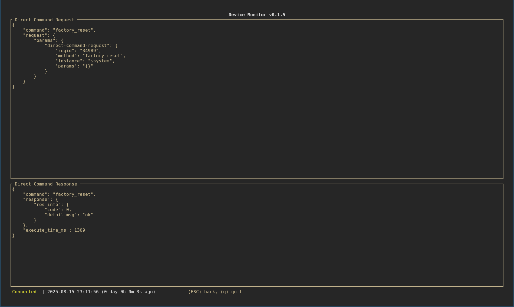

## Azurite Storage Modules Screen

When you press **e** from the main screen, the screen will switch to the Azurite Storage Modules screen.

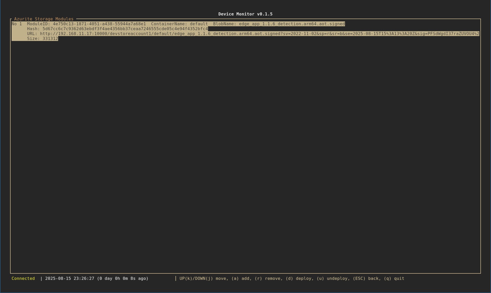

In this screen, all EdgeApp modules and OTA files that can be deployed to the edge device are displayed.

You can use **Up/k** and **Down/j** keys to move focus around the list. You can press the **d** key to deploy the focused module to the device as an EdgeApp module.

You can press the **a** key to specify a local module file and upload it to Azurite storage. Alternatively, you can press the **r** key to remove the module from Azurite storage.

## Token Provider Screens

When you press **t** from the main screen, the screen will switch to the Token Provider screen.

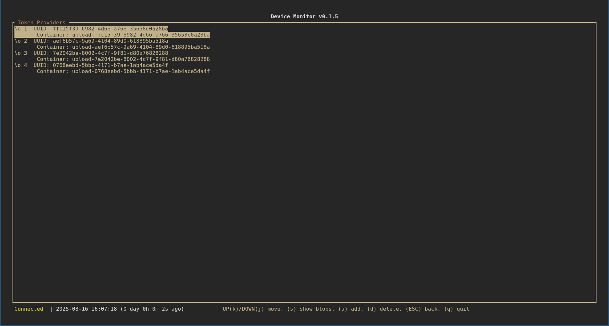

The token provider is used by EVP runtime to upload data to the cloud. The main use cases are uploading logs and inference data.

When you press the **a** key, `device-monitor` will create a new token provider automatically and the related information will be displayed on the screen.

Also, if you press the **s** key on a focused token provider entry, the data stored in the corresponding Azurite blob storage will be displayed on the screen.

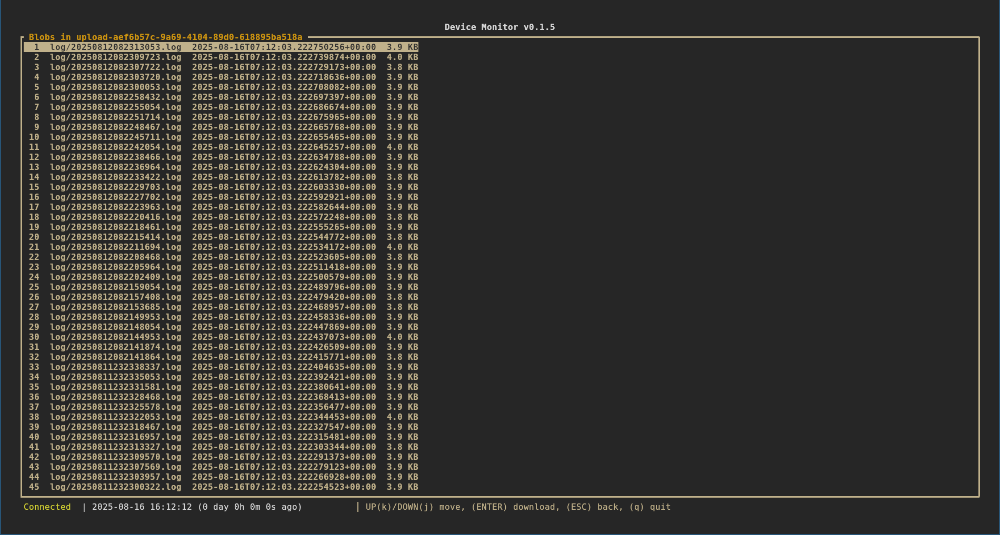

Furthermore, you can press **Enter** to download the selected blob file.

Also, the screen will transition to the Token Provider screen whenever you need to specify a token provider. For example, when you press the **i** or **a** key in the `storage_name` field of log settings in the System Settings section, the screen will switch to the Token Provider screen so that you can select a token provider.

## Event Log Screen

When you press **g** from the main screen, the screen will switch to the Event Log screen.

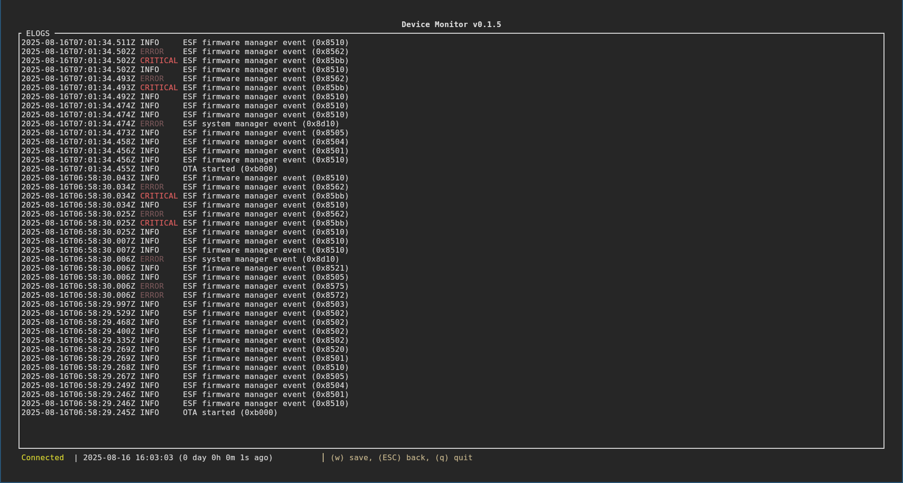

When you press the **w** key, the event log will be saved to the current working directory in JSON format.

## AI Model Deploy Screen

When you press **a** from the main screen, the screen will switch to a screen displaying the state of AI models deployed to the device.

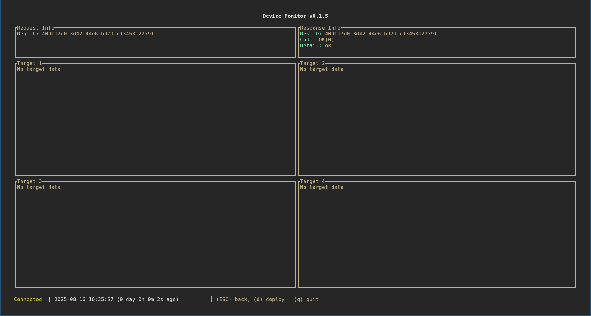

There are a total of 4 AI model states that can be deployed to the device. When you press the **d** key, the screen will switch to the AI model deploy screen.

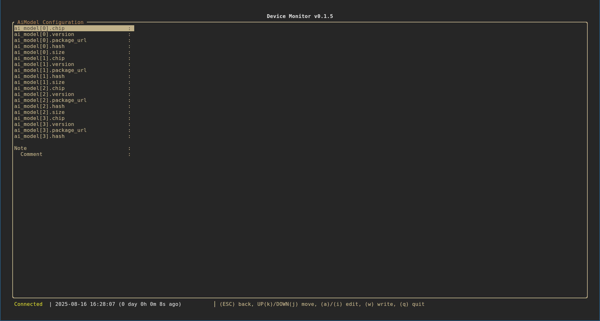

Note that when you press the **a** or **i** key in the `XXX_package_url` field, the screen will switch to the Azurite Storage Modules screen so that you can select an AI model package to deploy.

## OTA Screen

When you press **o** from the main screen, the screen will switch to the OTA state screen.

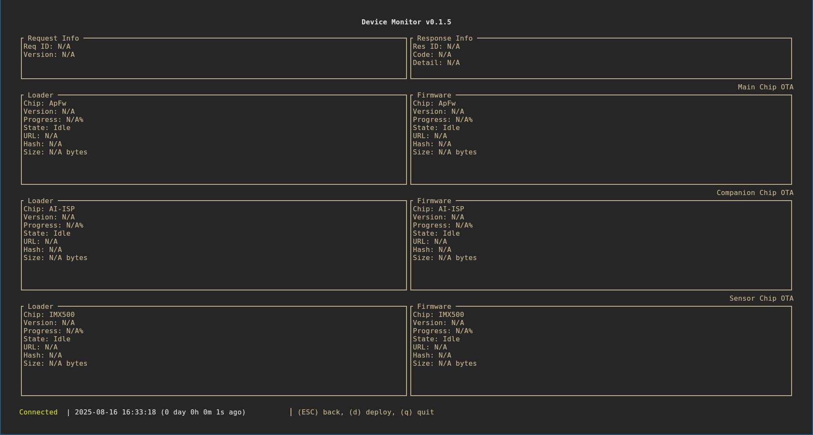

When you press the **d** key, the screen will switch to the OTA deploy screen.

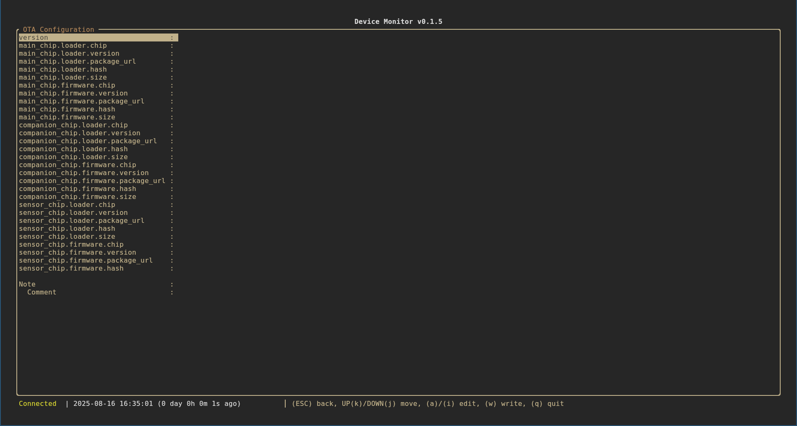

Note that when you press the **a** or **i** key in the `XXX_package_url` field, the screen will switch to the Azurite Storage Modules screen so that you can select an OTA package to deploy.

## Exit Screen

When you press **q** from the main screen, the screen will switch to the Exit screen.

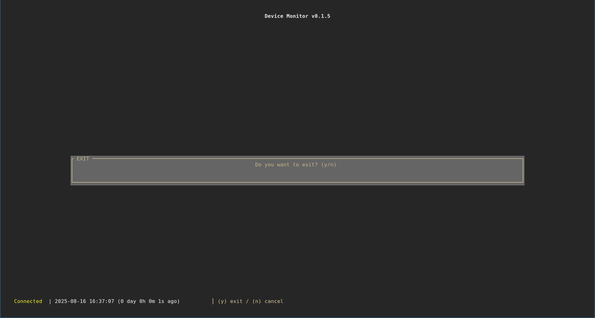

When you press the **y** key, the application will exit.
